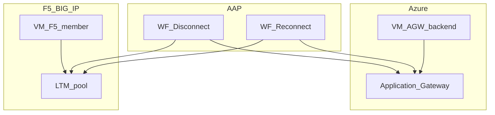

# AGW and F5 Load Balancer VM Management Demo


## Introduction

Automates **verification, drain, disconnection, and reconnection** of VMs behind **Azure Application Gateway** and **F5 BIG-IP** (Use Case 1). Two Azure VMs demonstrate AGW and F5 paths through AAP workflow templates.

## How to run the demo

| Phase | Workflow / template | Purpose | Mode |
|---|---|---|---|
| 0. Setup (optional) | `WF - Demo setup` | Provision Azure infrastructure and register the F5 pool member | Lab/dev only |
| 1. Scenario | `WF - Disconnect VM from load balancer` | Connectivity check → pool preview → verify presence → verify status → drain/disconnect → collect | Always |
| 1. Scenario | `WF - Reconnect VM to load balancer` | Connectivity check → pool preview → reconnect → verify status → collect | Always |
| 2. Teardown (optional) | `WF - Demo teardown` | Remove F5 pool membership and deprovision Azure resources | Lab/dev only |

Phases 0 and 2 only exist when `demo_manage_infrastructure: true` (default); see [Deployment modes](#deployment-modes) for the customer/PoC mode that runs phase 1 only, against pre-existing infrastructure. Both scenario workflows now start with a read-only connectivity check and pool preview (see [Job templates](#job-templates)) before making any change.

Launch either scenario workflow from AAP **Templates** with survey values for `lb_backend_type` and the target VM hostname; the target IP is resolved automatically (see [Automatic private IP discovery](#automatic-private-ip-discovery)) unless you supply an explicit override.

## Application Gateway backend discovery

This environment associates AGW backend pool membership with the target VM's **NIC ipConfiguration**, not with a static backend IP address. Every `LB - *` scenario and dry-run template therefore discovers the Application Gateway (name, resource group, backend pool) dynamically at runtime from `agw_vm_hostname`'s primary network interface — see `playbooks/demo/tasks/agw_discover_from_nic.yml`. There is no `agw_name` / `agw_backend_pool_name` variable to configure for these templates; only `agw_vm_hostname` and `azure_resource_group` (the VM's resource group) are needed.

`LB - Drain and disconnect VM` records the removed backend pool's resource ID in a `lb_agw_backend_pool_id` tag on the VM, so `LB - Reconnect VM to pool` — potentially launched much later, in a separate job run — can restore the exact same NIC-to-pool association without it being passed in again (mirroring how a stateful detach/reattach controller would persist this information). `LB - Pool status preview (dry run)` reports both the live association and, when absent, this saved one.

`agw_name` / `agw_backend_pool_name` still exist as variables, but only `Setup - Azure infrastructure` reads them (lab/dev only), to perform the *initial* NIC attachment when the demo bootstraps its own environment — see [Deployment modes](#deployment-modes) and [docs/setup.md](docs/setup.md#application-gateway-backend-discovery).

**Limitation:** only the VM's first network interface and its primary IP configuration are inspected — multi-NIC VMs, or a pool attached to a secondary NIC/IP configuration, are out of scope for this demo.

## F5 pool and partition discovery

F5 BIG-IP ties pool membership to a **pool + partition + port** combination, and the same node IP can be a member of several pools at once. Every `LB - *` scenario and dry-run template discovers **every** such membership dynamically at runtime from the target VM's resolved private IP — see `playbooks/demo/tasks/f5_discover_pool_from_ip.yml` — instead of reading a fixed `f5_pool_name`/`f5_partition`/`f5_pool_member_port` variable. There is no pool/partition/port to configure for these templates; only `f5_server`/`f5_username` (plus `f5_password` from vault) are needed, in every deployment mode.

These same raw REST calls authenticate via a BIG-IP iControl REST token (`playbooks/demo/tasks/f5_authenticate.yml`), not HTTP Basic Auth: `f5_username`/`f5_password` are POSTed once to `/mgmt/shared/authn/login` with `loginProviderName` (`f5_login_provider_name`, default `tmos`), and the returned token is reused as an `X-F5-Auth-Token` header. See [docs/setup.md](docs/setup.md#f5-pool-and-partition-discovery) for why.

`LB - Drain and disconnect VM` / `LB - Reconnect VM to pool` act on **every** discovered membership at once, not just one — draining or reconnecting a node changes its state consistently across every pool it belongs to. `f5_pool_name`/`f5_partition`/`f5_pool_member_port` still exist as variables, but only `Setup - F5 pool member` / `Teardown - F5 pool member` read them (lab/dev only), to create or remove the *very first* membership when the demo bootstraps its own environment — see [Deployment modes](#deployment-modes) and [docs/setup.md](docs/setup.md#f5-pool-and-partition-discovery). `f5_pool_member_port` is a further optional override within that lab/dev scope: both templates default it to `80` when left unset.

**Limitation:** the member port is parsed from the `<address>:<port>` member name by splitting on the last `:` (IPv4 only). Discovery only sees partitions the F5 API credential can access.

## Automatic private IP discovery

`agw_vm_private_ip` and `f5_vm_private_ip` are **optional overrides**, not required variables. Every consumer (the `LB - *` templates, `Setup`/`Teardown - F5 pool member`, and `Setup - Azure infrastructure`) resolves the VM's current primary private IP automatically from its hostname via the same Azure VM/NIC lookup pattern used for [Application Gateway backend discovery](#application-gateway-backend-discovery) above — see [docs/setup.md](docs/setup.md#automatic-private-ip-discovery). Set either variable explicitly only to override auto-discovery (for example a multi-NIC VM).

## Azure authentication mode

`azure_auth_mode` in `demo_variables.yml` (default `service_principal`) selects how every `azure.azcollection` task authenticates, independent of the deployment mode below:

| `azure_auth_mode` | Requires | Notes |
|---|---|---|
| `service_principal` (default) | `vault_azure_client_id` / `vault_azure_client_secret` | Credentials injected by AAP's "Azure Service Principal" credential. Works on any AAP topology and is the only option if AAP does not run on Azure. |
| `msi` | Nothing stored in AAP | `auth_source: msi` on every `azure_rm_*` task acquires a token from the Azure Instance Metadata Service (IMDS) endpoint. AAP's execution node/EE container must itself be an Azure resource with a Managed Identity enabled — see [docs/setup.md](docs/setup.md#azure-authentication-mode-service-principal-vs-managed-identity). |

`azure_auth_mode` must be threaded through `extra_vars` on every Azure-facing job template (already done in `group_vars/all/job_templates.yml` / `job_templates_infra.yml`): `playbooks/demo/*.yml` and `playbooks/setup/*.yml` run against AAP's generated inventory, which does not reliably auto-load `group_vars/all/demo_variables.yml`.

## Deployment modes

`demo_manage_infrastructure` in `demo_variables.yml` (default `true`) controls how much of the AAP catalog this CasC creates:

| Mode | `demo_manage_infrastructure` | AAP objects created | Use when |
|---|---|---|---|
| Lab / dev | `true` (default) | Full lifecycle: `Setup - Azure infrastructure`, `Setup - F5 pool member`, `Teardown - Azure infrastructure`, `Teardown - F5 pool member`, `WF - Demo setup`, `WF - Demo teardown`, plus all scenario and dry-run objects | You are running the demo yourself and want AAP to create and destroy the Azure VMs/AGW and register the F5 pool member |
| Customer / PoC | `false` | Only the scenario job templates (`LB - Connectivity check (dry run)`, `LB - Pool status preview (dry run)`, `LB - Verify VM in pool`, `LB - Verify connection status`, `LB - Drain and disconnect VM`, `LB - Reconnect VM to pool`, `LB - Collect results`) and their two workflows | The customer already provides the Azure VM/AGW and F5 pool member; no provisioning or teardown object is created in AAP, removing any risk of accidentally launching a job that creates duplicate Azure resources or removes the customer's existing F5 pool member |

In customer mode, set `azure_resource_group` / `agw_vm_hostname` / `f5_server` / `f5_vm_hostname` to the customer's existing resources. `agw_name` / `agw_backend_pool_name` / `f5_pool_name` / `f5_partition` do **not** need to be set in customer mode — the Application Gateway is discovered dynamically from the VM's NIC, and the F5 pool/partition/port dynamically from the target IP (see [Application Gateway backend discovery](#application-gateway-backend-discovery) and [F5 pool and partition discovery](#f5-pool-and-partition-discovery)); those variables only matter to `Setup - Azure infrastructure` / `Setup - F5 pool member`, which are not even deployed in customer mode. `agw_vm_private_ip` / `f5_vm_private_ip` / `f5_pool_member_port` do not need to be set in either mode — see [Automatic private IP discovery](#automatic-private-ip-discovery) (the first two) and [F5 pool and partition discovery](#f5-pool-and-partition-discovery) (`f5_pool_member_port` defaults to `80`).

`group_vars/all/demo_variables.yml.example` **and** `vault.yml.example` mark every variable/secret with `[ALWAYS REQUIRED]` or `[LAB/DEV ONLY]` banners so you can see at a glance what customer/PoC mode needs. `playbooks/aap_config.yml` and `playbooks/verify.yml` enforce this: the `[LAB/DEV ONLY]` variables are only validated when `demo_manage_infrastructure: true`, so leaving them at their example defaults never blocks a customer/PoC deployment.

## Quick start

```bash
cd artifacts/demos/aap-demo-loadbalancing-agw-f5
ansible-galaxy collection install -r collections/requirements.yml -p collections
cp ansible.cfg.example ansible.cfg
cp group_vars/all/demo_variables.yml.example group_vars/all/demo_variables.yml
cp vault.yml.example vault.yml && ansible-vault encrypt vault.yml
ansible-playbook playbooks/aap_config.yml --vault-id @prompt
```

See [docs/setup.md](docs/setup.md) for prerequisites, EE build instructions, and the setup workflow.

## Reset / teardown

```bash
ansible-playbook playbooks/aap_cleanup.yml -e demo_cleanup_confirm=true --vault-id @prompt
```

## Architecture



## Multicloud inventory UX (UC4)

```
Demo-LoadBalancingAGWF5
└── Azure-Resources-LoadBalancingAGWF5
    ├── azure_vms (AGW + F5 VMs)
    └── azure_loadbalancers (AGW/F5 metadata)
```

## Job templates

The **Setup** and **Teardown** templates are only created in AAP when `demo_manage_infrastructure: true` (see [Deployment modes](#deployment-modes)); the **scenario** and **dry-run** templates are always created and are wired into both scenario workflows (see [How to run the demo](#how-to-run-the-demo)).

| Template | Playbook | Mode |
|---|---|---|
| LB - Verify VM in pool | `demo/lb_verify_presence.yml` | Always |
| LB - Verify connection status | `demo/lb_verify_status.yml` | Always |
| LB - Drain and disconnect VM | `demo/lb_drain_disconnect.yml` | Always |
| LB - Reconnect VM to pool | `demo/lb_reconnect.yml` | Always |
| LB - Collect results | `demo/lb_collect_results.yml` | Always |
| Setup - Azure infrastructure | `setup/01_azure_setup.yml` | Lab/dev only |
| Setup - F5 pool member | `setup/02_f5_setup.yml` | Lab/dev only |
| Teardown - Azure infrastructure | `setup/01_azure_teardown.yml` | Lab/dev only |
| Teardown - F5 pool member | `setup/02_f5_teardown.yml` | Lab/dev only |

**Standalone launch default:** every `LB - *` template above ships `ask_variables_on_launch: true` **and its own survey** (mirroring the workflow survey, scoped to that single template — see `group_vars/all/job_templates.yml`), so it can also be launched directly from the AAP UI, without going through either workflow. The launch prompt asks for `lb_backend_type`/`target_vm_hostname` (and, where applicable, an optional `target_vm_ip` override) with the `agw` / `agw_vm_hostname` defaults pre-filled; none of the questions are `required`, so leaving one blank at launch simply falls back to that same default — a standalone launch always targets the **AGW** VM unless you explicitly answer the survey (or pass `-e` overrides) for both values. Inside `WF - Disconnect/Reconnect VM from load balancer`, the job template's own survey is not re-prompted: the workflow's survey answers for these same two keys take precedence and select the backend/VM instead (see [How to run the demo](#how-to-run-the-demo)).

### Dry-run / preview templates

Read-only checks, useful in both deployment modes. Wired as the first two nodes of both scenario workflows (ahead of any mutating task) and also launchable standalone.

| Template | Playbook | Checks |
|---|---|---|
| LB - Connectivity check (dry run) | `demo/lb_precheck_connectivity.yml` | Confirms Azure (via the target VM/NIC) and the F5 BIG-IP API (generic pool-collection reachability, no fixed pool) are both reachable with the configured credentials — never mutates anything |
| LB - Pool status preview (dry run) | `demo/lb_pool_preview.yml` | Reports whether the target VM is currently present in the AGW pool (discovered from its NIC) or in one or more F5 pools (discovered from its IP — see [F5 pool and partition discovery](#f5-pool-and-partition-discovery)), i.e. what drain/disconnect or reconnect would actually change — never mutates anything |

## Collections

| Collection | Tier | Purpose |
|---|---|---|
| infra.aap_configuration | validated | CasC |
| azure.azcollection | certified | Application Gateway |
| f5networks.f5_modules | certified | F5 pool members |
| ansible.netcommon | certified | F5 httpapi connection |
| ansible.controller | certified | Post-CasC EE/inventory wiring in `aap_config.yml`; explicit object deletion in `aap_cleanup.yml` |

## References

- Red Hat AAP 2.6 documentation
- Azure Application Gateway product documentation
- F5 BIG-IP iControl REST API documentation
